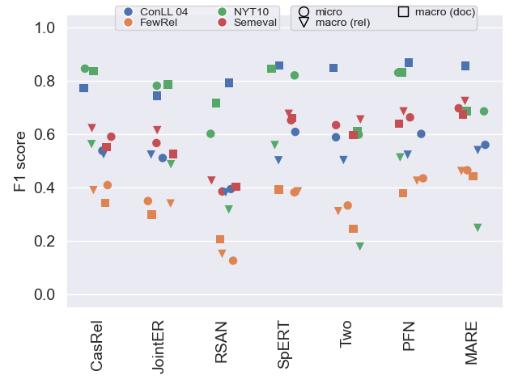
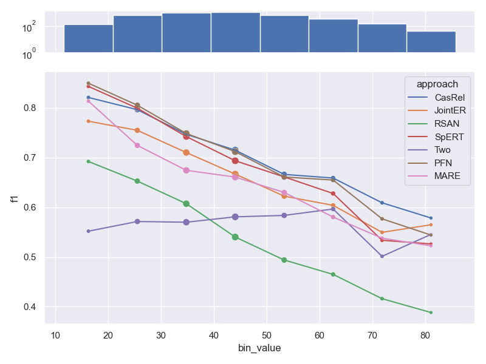
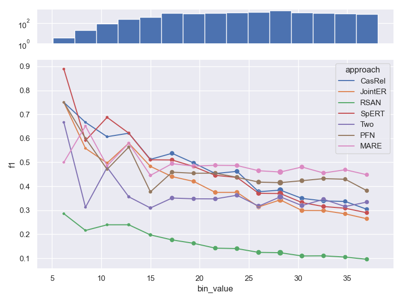
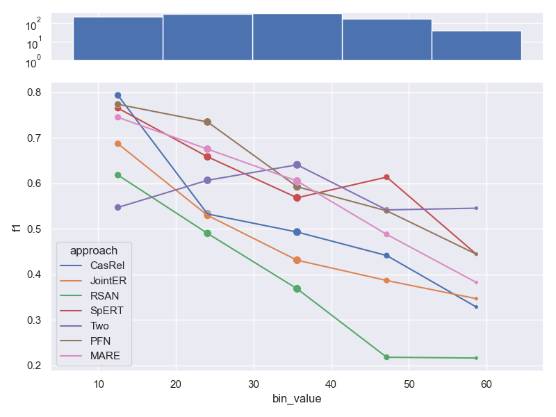
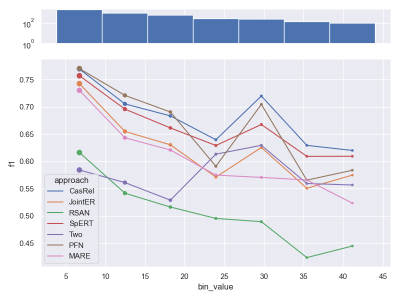
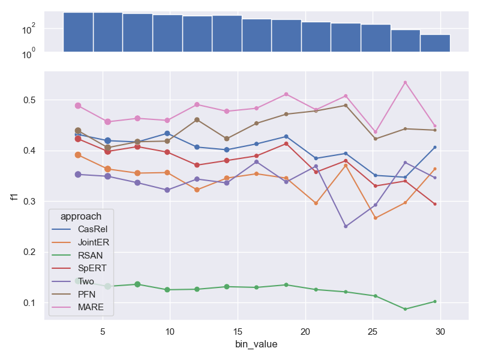
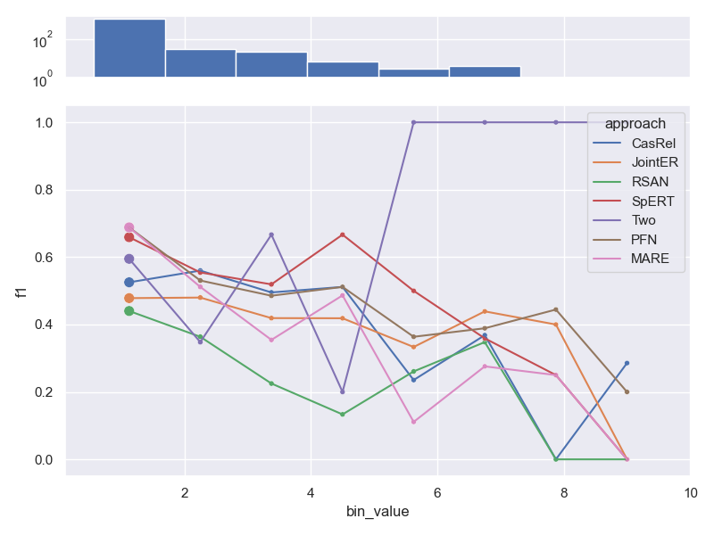
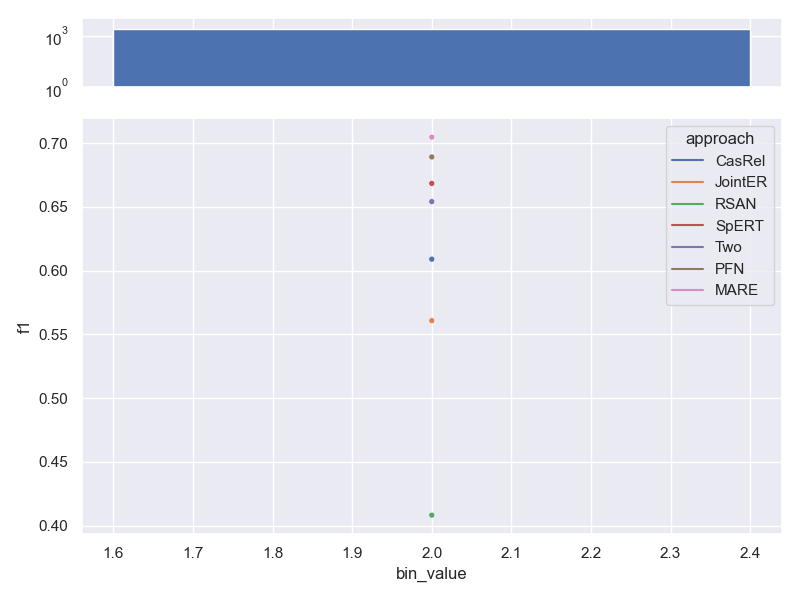
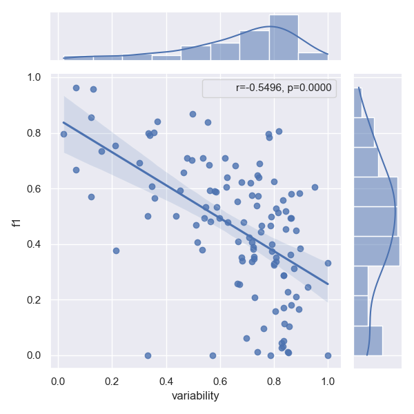
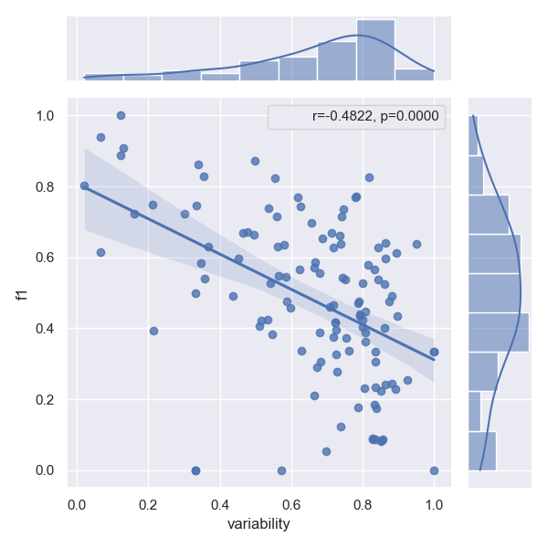

# Study on Joint Entity and Relation Extraction 

This is the code for our 2023 CAiSE submission.

# Setup
1. Install the [Anaconda](https://www.anaconda.com/products/distribution) python package manager
2. Setup a virtual environment via conda: `conda env create -f environment.yml`
3. Activate the environment via `conda activate relation-extraction-study` 

## Data
To get the data we used, follow one of these options:

1. Create the data yourself: Go to `data/input/` and follow the `README` 
   in each of the sub-folders to create the datasets in intermediary format.
2. Unzip `data.7z`, to obtain the data in intermediary format as processed by us.

Run `python datahelper.py` to convert the input datasets into all required formats.

# Producing results table

We stored the result files for approaches that were trained and tested in `metrics/results`.

Run `python evalhelper.py` to get an updated table with all results, as well as all figures we
used in our publication. Both figures and table will be stored in `figures/`.

# Reproducing results for approaches

This chapter will guide you through producing all the results as stored in `metrics/results`.

## Requirements

For reproducing all training runs for all approaches you need a machine with

- Ubuntu 20.04
- Cuda-capable graphics card with at least 24 GB or memory, tested on an NVIDIA TITAN RTX, 
  driver version 470.129.06, CUDA Version: 11.4
- [jsonnet](https://www.cyberithub.com/how-to-install-jsonnet-on-ubuntu-20-04-lts/)

## Steps

Following are the common steps needed to prepare a single approach from the list 
of [considered approaches](#considered-approaches)

1. Clone the approach you want to generate results for (see section [Considered Approaches](#considered-approaches)
2. Navigate into the cloned folder
3. Use the provided conda environment file (environment.yml) to create a 
   virtual environment via `conda env create -f environment.yml`
4. Follow the detailed data setup steps for the approach in question in next section 
   [Setting up approaches](#setting-up-approaches)
   for the approach you want to reproduce.
5. Run `bash run_trainings.sh` in the root folder of the approach you want to test
6. Run `bash run_evaluations.sh` in the root folder of the approach you want to test
7. Move the results file from the approaches project folder to `metrics/results/<approach-id>/<dataset-name>/`, 
   see section [Setting up approaches](#setting-up-approaches) to find out where it is stored for 
   the approach in question.
8. Run `python evalhelper.py` to get an updated table with all results.

# Considered approaches

| Approach                | Our Modification                                               |
|-------------------------|----------------------------------------------------------------|
| Two are better than one | https://anonymous.4open.science/r/two-are-better-than-one-9C77 |
| RSAN                    | https://anonymous.4open.science/r/RSAN-B937                    |
| CasRel                  | https://anonymous.4open.science/r/CasRel-46CC                  |
| JointER                 | https://anonymous.4open.science/r/JointER-1748                 |
| PFN                     | https://anonymous.4open.science/r/PFN-custom-1245              |
| spert                   | https://anonymous.4open.science/r/spert-4071                   |
| mare                    | https://anonymous.4open.science/r/mare-51CB                    |

# Setting up approaches

## Two are better than one

Move `train.json`, `test.json`, `dev.json` of each dataset `<dataset>` you want to reproduce to  
`datasets/unified/train.<dataset>.json`, `datasets/unified/test.<dataset>.json` and 
`datasets/unified/valid.<dataset>.json` respectively.

E.g. move `data/export/nyt10/two-are-better-than-one/train.json` to `datasets/unified/train.nyt10.json`.

## RSAN

### Data

Move `train.json`, `test.json`, `dev.json` of each dataset `<dataset>` you want to reproduce to  
`data/ai4/<dataset>/origin`.

E.g. move `data/export/nyt10/rsan/{test,train,dev}.json` from this project to `data/ai4/nyt10/origin` inside the 
RSAN project.

### Results

Results can be found in `results/<dataset>/results.json`.

## CasRel

Move `train_triples.json`, `test_triples.json`, `dev_triples.json` of each dataset `<dataset>` 
you want to reproduce to `data/ai4-<dataset>/`. 

E.g. move `data/export/nyt10/casrel/{test_triples,train_triples,dev_triples}.json` from this project to 
`data/ai4-nyt10/` inside the CasRel project.

### Results

Results can be found in `results/ai4-<dataset>/test_result.json`

## JointER

Move `train.json`, `test.json`, `dev.json` of each dataset `<dataset>` you want to reproduce 
to `dataset/ai4/<dataset>/data`.

E.g. move `data/export/nyt10/joint-er/{test,train,dev}.json` from this project 
to `dataset/ai4/nyt10/data` inside the JointER project.

### Results

Results can be found in `saved_models/ai4<dataset>/best_test_results.json`.

## Progressive Multitask

Download [glove.6B.zip](https://nlp.stanford.edu/projects/glove/) and unpack to 
`dataset/glove/` inside the progressive multitask project.

Move `train.json`, `test.json`, `dev.json` of each dataset `<dataset>` you want to reproduce to  
`dataset/<dataset>-ai4`.

E.g. move `data/export/nyt10/progressive-multtask/{test,train,dev}.json` 
from this project to `dataset/nyt10-ai4` inside the progressive multitask project.

### Results

Progressive multitask neither decodes internal (tensor) representations of predictions,
nor stores it predictions on disk. Results are reported to the command line during training.

## PFN

### Data

Move `train.json`, `test.json`, `dev.json` of each dataset `<dataset>` you want to reproduce 
to `data/ai4/<dataset>`.

E.g. move `data/export/nyt10/pfn/{test,train,dev}.json` from this project 
to `data/ai4/nyt10` inside the PFN project.

### Results

Results are stored in the root folder at `result-<dataset>.json`.

## spert

Move `train.json`, `test.json`, `dev.json` of each dataset `<dataset>` you want to reproduce to  
`data/datasets/ai4-<dataset>`.

E.g. move `data/export/nyt10/spert/{test,train,dev}.json` 
from this project to `data/datasets/ai4-nyt10` inside the spert project.

### Running evaluation

Spert stores models inside `data/save/<run-id>/<date-and-time>/final_model`. To use this model
for evaluation copy the contents of this folder to `data/models/<run-id>`.

### Results

Results can be found at `data/log/<dataset>_eval/<run_date_time>/predictions_test_epcoh_0.json`.

## mare

Move `train.jsonl`, `test.jsonl`, `dev.jsonl` of each dataset `<dataset>` you want to reproduce to  
`data/ai4-<dataset>`.

E.g. move `data/export/nyt10/mare/{test,train,dev}.jsonl` 
from this project to `data/ai4-nyt10` inside the mare project.

# Literature review

This study is based on a rigorous, reproducible literature review according to the principles of the [PRISMA]([https://www.google.com](https://www.prisma-statement.org/)) methodology. This methodology (visualized above) requires to document search queries used to identify potentially relevant publications, criteria for selecting/discarding papers and, finally, full-text reviews of the selected publications. The following subsections describe how the study fulfills those requirements. Detailed justifications for the decisions made can be found in the corresponding paper ("Bridging research fields: An empirical study on joint, neural relation extraction techniques").

## Search queries
The following table describes all search queries used to retrieve publications relevant to the domain of relation extraction. The queries were used in Scpous and Google Scholar. Since Google Scholar limits the number of retrievable results for each query to a maximum of 1000 results, we split the queries to return fewer than 1000 results and then combined the result sets. All queries were applied to title and full text.

| ID | Search Query                                                                                                                             |
|----|------------------------------------------------------------------------------------------------------------------------------------------|
| Q1 | "relation" OR "relation extraction" OR "relation classification") AND ("deep learning" OR "neural network")  AND ("tacred")              |
| Q2 | ("relation" OR "relation extraction" OR "relation classification") AND ("deep learning" OR "neural network") AND ("docred")              |
| Q3 | ("relation" OR "relation extraction" OR "relation classification") AND ("deep learning" OR "neural network") AND ("fewrel")              |
| Q4 | ("relation" OR "relation extraction" OR "relation classification") AND ("deep learning" OR "neural network") AND ("NYT10")               |
| Q5 | ("relation" OR "relation extraction" OR "relation classification") AND ("deep learning" OR "neural network") AND ("SemEval-2010 Task 8") |

The term *relation extraction* raises two issues:
1. It is a rather broad term. 
2. It is also an ambigous term, since it is often mixed up with the term *relation classification*. 

This is how the queries above handle these issues. To handle the ambiguity we accept both terms *relation classification* and *relation extraction*. To avoid a too specific focus, we also accept the keyword "relation" without any additions. Since we are only interested in deep learning approaches, each query contains the keywords "deep learning" or "neural network". The third AND clause deals with the most common datasets used in NLP research to evaluate relation extraction approaches. The idea behind including dataset names in the query is to assume that almost every reputable approach is evaluated on at least one of these common datasets. Therefore, a large number of articles that do not contain an evaluation (e.g. surveys and literature reviews) are filtered out directly. Moreover, this is a sure indication that an article proposes relation extraction for natural text, rather than relation extraction approaches from other research fields, such as time series analysis. It is worth noting that without the names of the datasets, the keywords would be too broad, yielding approximately 13,000 results. Note that we do not use keywords such end2end or jointly in any query, as these terms are not used consistently in the literature. Therefore, we are likely to accept a significant number of approaches that are not end2end, which must then be manually filtered out.

The queries were run on 03/25/2022, so approaches after that date are not included in this study. To reduce the number of articles to a manageable level, we automatically applied an impact filter that expects a citation rate of one citation per year for older approaches. Approaches published in 2020 or later do not have to meet this criterion due to the short time span since publication of the corresponding articles. We chose not to use a stronger threshold or a peer-review criterion, because we aim to provide a complete and very up-to-date overview of the current state of research. Applying the citation criterion to all results or excluding preprints would therefore lead to the exclusion of very recent work. Overall, after eliminating duplicates, we are left with *1845* results remain. For validation, we checked whether the result included all articles found by the authors in a previous manual search (*41* articles). In this way, two additional articles were identified, so that the retrieval stage yielded *1847* results. We did not use a snowballing strategy because the search queries used are broad enough to cover most articles.

## Filtering
PRISMA requires to define a set of EXCLUSION criteria used to discard publications that are contained in the results of the search queries but are still considered to be irrelevant to the research focus. We used the following exclusion criteria:
* EXCL 1: The article is not written in English. 
* EXCL 2: The paper does not present a new relation extraction approach. 
* EXCL 3 (English): The approach does not handle English text input.
* EXCL 4 (Neural): It is not a deep learning approach.
* EXCL 5 (Open Source): Code is not publicly available.
* EXCL 6 (Jointly trained models): The approach does not train the extraction of entities and relations jointly. 
* EXCL 7 (No domain-specific knowledge base): The approach uses a (domain-specific) knowledge base.

## Manual review
After manually reviewing title and abstract of all identified papers, there is still a subset not relevant to the research focus. This is the case if title and abstract are rather vague requiring a detailed review based on the papers' full texts.

# Experiments
In the following we provide a brief overview of our experiments that follow our intention to identify approaches that can be used "out-of-the-box" to extract both entities and relations from human-readable text across arbitrary domains.  
## Experimental design
Our experiments for approaches selected via our systematic Literature Review follow the procedure visualized below. Details about the respective steps can be found in our paper. The following is a short summary:
* Stage 1: To get an idea of the approaches' transferability we apply them on diverse datasets that show different characteristics. 
* Stage 2: Some of those datasets have to be enriched with further information (e.g. POS tags) and require tokenization.
* Stage 3: The result of Stage 2 is stored in a stream-based JSON representation, a intermediate format we defined for easy conversion to various target formats.
* Stage 4: From the intermediate formats we derive approach-specific representations.
* Stage 5: We set up the experiments for all selected approaches to evaluate them on all those datasets.
* Stage 6: Based on the predictions produced we measure several scores for each approach (Macro F1, Micro F1 in two versions).

## Additional experimental results

### Overview of model performance
The following plots show F1 scores in all three variants (see our paper for details)
on all datasets. This helps to get an understanding of general model performance.

**Test data** 

As shown in our paper

**Validation data** 

Approaches generally use validation data to select the top performing configuration,
which is why scores tend to be higher than on test data.

### Effects of sample length on performance
* Dataset NYT 10, as shown in our paper. We don't visualize bins for very long samples, 
  as they contain only a small number of samples. This results in very high variability 
  of metric values (c.f. [Law of small numbers](https://en.wikipedia.org/wiki/Faulty_generalization#Hasty_generalization)).  
  
* Dataset FewRel. Contrary to all other datasets, FewRel has some samples that are made up 
  of only a few tokens. While we don't visualize bins that contain very few samples at
  the end of the graph (e.g. samples that contain a lot of tokens), we still visualize 
  those early bins. We can clearly see the effects of the law of small numbers, as the 
  performance jumps around a lot. Furthermore, the range of number of tokens per sample is
  quite small (~15-~35), resulting in a less pronounced downwards trend compared to other
  datasets.  
  
* Dataset CoNLL04.  
  
* Dataset SemEval.  
  

### Effects of distance between relation arguments
* Dataset NYT 10, as shown in our paper. Note, that the distance between relation 
  arguments is correlated with the length of a sample, which is why trends are similar.  
  
* Dataset FewRel.  
  
* Dataset ConLL04.  
  
* Dataset SemEval.  
  

### Effect of number of relations per sample on performance
The number of relations per sample has only a minor detrimental effect on performance.
Only MARE seems to struggle with additional relations per sample. We did not show this  
analysis in our paper.

* Dataset NYT 10.  
  
* Dataset FewRel. Contains the same number of relations per sample, so no trend can be shown.  
  
* Dataset ConLL04.  
  
* Dataset SemEval. Contains the same number of relations per sample, so no trend can be shown.  
  

### Effects of linguistic variability on performance 

Please refer to our paper for a proper definition of linguistic variability. Intuitively
linguistic performance across all arguments of a relation type makes predicting this
type harder, which is evident, when we plot variability against the f1 score of a given 
relation type. The correlation factor (r) determines how well a model can cope with this 
additional challenge. The p-value shows how certain we are that this effect is not just
random, but indeed a correlation. Following previous work, we reject that a correlation 
exists at all, iff p>0.0005

* Approach CasRel  
  
* Approach JointER  
  
* Approach MARE  
  
* Approach PFN  
  
* Approach RSAN  
  
* Approach SpERT  
  
* Approach Two are better than one  
  

### Confusion between relation types

We can plot confusion matrices for all approaches, to show what relation types are
mixed up in prediction. This is only feasible for a handful of types, which is why we 
show only CoNLL04 here (5 relation types). *Note that this only shows what relations 
are mixed up, but not if an approach fails to identify a relation, or fails predicts its 
arguments*.

* CasRel on CoNLL04 test  
  
* JointER on CoNLL04 test  
  
* MARE on CoNLL04 test  
  
* PFN on CoNLL04 test  
  
* RSAN on CoNLL04 test  
  
* SpERT on CoNLL04 test  
  
* Two are better than one on CoNLL04 test  
  

### Coupling between entity pos tags and relation type

An intuitive explanation of why some datasets are easier to model is the coupling
of entity pos tags, their ner tags and the possible relations between them. Perfect
coupling between a combination of ner-tags and a relation type would theoretically
make the task of relation *type* prediction trivial (not the task of predicting the 
existence of a relation in the first place). A good example for this perfect coupling
can be found in CoNLL04, where a relation between entities PEOPLE and PEOPLE is always
KILL. 

We annotated tokens of all datasets with their respective ner tags and counted the 
number of times a relation between two entities occurs, i.e. its argument entities. 
*Note, that we used the stanza toolkit for this task, which does not yield perfect 
results and often times tags tokens with the ner tag UNKNOWN*.

The resulting matrices are shown below for all datasets.

* ConLL04  
  
* FewRel  
  
* NYT 10  
  
* SemEval 2010 task 8  
  