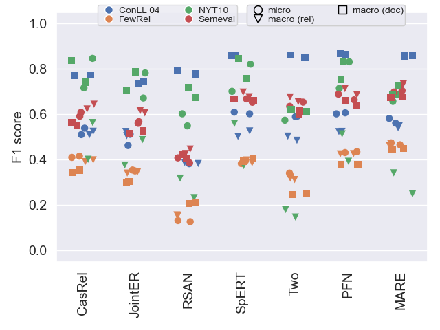

# Anonymous Relation Extraction Comparative Study 

This is the code for our 2023 CAiSE submission.

# Setup
1. Install the [Anaconda](https://www.anaconda.com/products/distribution) python package manager
2. Setup a virtual environment via conda: `conda env create -f environment.yml`
3. Activate the environment via `conda activate relation-extraction-study` 

## Data
To get the data we used, follow one of these options:

1. Create the data yourself: Go to `data/input/` and follow the `README` 
   in each of the sub-folders to create the datasets in intermediary format.
2. Unzip `data.7z`, to obtain the data in intermediary format as processed by us.

Run `python datahelper.py` to convert the input datasets into all required formats.

# Producing results table

We stored the result files for approaches that were trained and tested in `metrics/results`.

Run `python evalhelper.py` to get an updated table with all results, as well as all figures we
used in our publication. Both figures and table will be stored in `figures/`.

# Reproducing results for approaches

This chapter will guide you through producing all the results as stored in `metrics/results`.

## Requirements

For reproducing all training runs for all approaches you need a machine with

- Ubuntu 20.04
- Cuda-capable graphics card with at least 24 GB or memory, tested on an NVIDIA TITAN RTX, 
  driver version 470.129.06, CUDA Version: 11.4
- [jsonnet](https://www.cyberithub.com/how-to-install-jsonnet-on-ubuntu-20-04-lts/)

## Steps

Following are the common steps needed to prepare a single approach from the list 
of [considered approaches](#considered-approaches)

1. Clone the approach you want to generate results for (see section [Considered Approaches](#considered-approaches)
2. Navigate into the cloned folder
3. Use the provided conda environment file (environment.yml) to create a 
   virtual environment via `conda env create -f environment.yml`
4. Follow the detailed data setup steps for the approach in question in next section 
   [Setting up approaches](#setting-up-approaches)
   for the approach you want to reproduce.
5. Run `bash run_trainings.sh` in the root folder of the approach you want to test
6. Run `bash run_evaluations.sh` in the root folder of the approach you want to test
7. Move the results file from the approaches project folder to `metrics/results/<approach-id>/<dataset-name>/`, 
   see section [Setting up approaches](#setting-up-approaches) to find out where it is stored for 
   the approach in question.
8. Run `python evalhelper.py` to get an updated table with all results.

# Considered approaches

| Approach                | Our Modification                                               |
|-------------------------|----------------------------------------------------------------|
| Two are better than one | https://anonymous.4open.science/r/two-are-better-than-one-9C77 |
| RSAN                    | https://anonymous.4open.science/r/RSAN-B937                    |
| CasRel                  | https://anonymous.4open.science/r/CasRel-46CC                  |
| JointER                 | https://anonymous.4open.science/r/JointER-1748                 |
| PFN                     | https://anonymous.4open.science/r/PFN-custom-1245              |
| spert                   | https://anonymous.4open.science/r/spert-4071                   |
| mare                    | https://anonymous.4open.science/r/mare-51CB                    |

# Setting up approaches

## Two are better than one

Move `train.json`, `test.json`, `dev.json` of each dataset `<dataset>` you want to reproduce to  
`datasets/unified/train.<dataset>.json`, `datasets/unified/test.<dataset>.json` and 
`datasets/unified/valid.<dataset>.json` respectively.

E.g. move `data/export/nyt10/two-are-better-than-one/train.json` to `datasets/unified/train.nyt10.json`.

## RSAN

### Data

Move `train.json`, `test.json`, `dev.json` of each dataset `<dataset>` you want to reproduce to  
`data/ai4/<dataset>/origin`.

E.g. move `data/export/nyt10/rsan/{test,train,dev}.json` from this project to `data/ai4/nyt10/origin` inside the 
RSAN project.

### Results

Results can be found in `results/<dataset>/results.json`.

## CasRel

Move `train_triples.json`, `test_triples.json`, `dev_triples.json` of each dataset `<dataset>` 
you want to reproduce to `data/ai4-<dataset>/`. 

E.g. move `data/export/nyt10/casrel/{test_triples,train_triples,dev_triples}.json` from this project to 
`data/ai4-nyt10/` inside the CasRel project.

### Results

Results can be found in `results/ai4-<dataset>/test_result.json`

## JointER

Move `train.json`, `test.json`, `dev.json` of each dataset `<dataset>` you want to reproduce 
to `dataset/ai4/<dataset>/data`.

E.g. move `data/export/nyt10/joint-er/{test,train,dev}.json` from this project 
to `dataset/ai4/nyt10/data` inside the JointER project.

### Results

Results can be found in `saved_models/ai4<dataset>/best_test_results.json`.

## Progressive Multitask

Download [glove.6B.zip](https://nlp.stanford.edu/projects/glove/) and unpack to 
`dataset/glove/` inside the progressive multitask project.

Move `train.json`, `test.json`, `dev.json` of each dataset `<dataset>` you want to reproduce to  
`dataset/<dataset>-ai4`.

E.g. move `data/export/nyt10/progressive-multtask/{test,train,dev}.json` 
from this project to `dataset/nyt10-ai4` inside the progressive multitask project.

### Results

Progressive multitask neither decodes internal (tensor) representations of predictions,
nor stores it predictions on disk. Results are reported to the command line during training.

## PFN

### Data

Move `train.json`, `test.json`, `dev.json` of each dataset `<dataset>` you want to reproduce 
to `data/ai4/<dataset>`.

E.g. move `data/export/nyt10/pfn/{test,train,dev}.json` from this project 
to `data/ai4/nyt10` inside the PFN project.

### Results

Results are stored in the root folder at `result-<dataset>.json`.

## spert

Move `train.json`, `test.json`, `dev.json` of each dataset `<dataset>` you want to reproduce to  
`data/datasets/ai4-<dataset>`.

E.g. move `data/export/nyt10/spert/{test,train,dev}.json` 
from this project to `data/datasets/ai4-nyt10` inside the spert project.

### Running evaluation

Spert stores models inside `data/save/<run-id>/<date-and-time>/final_model`. To use this model
for evaluation copy the contents of this folder to `data/models/<run-id>`.

### Results

Results can be found at `data/log/<dataset>_eval/<run_date_time>/predictions_test_epcoh_0.json`.

## mare

Move `train.jsonl`, `test.jsonl`, `dev.jsonl` of each dataset `<dataset>` you want to reproduce to  
`data/ai4-<dataset>`.

E.g. move `data/export/nyt10/mare/{test,train,dev}.jsonl` 
from this project to `data/ai4-nyt10` inside the mare project.

# Literature review
This study is based on a rigorous, reproducible literature review according to the principles of the [PRISMA]([https://www.google.com](https://www.prisma-statement.org/)) methodology. This methodology requires to document search queries used to identify potentially relevant publications, criteria for selecting/discarding papers and, finally, full-text reviews of the selected publications. The following subsections describe how the study fulfills those requirements. Detailed justifications for the decisions made can be found in the corresponding paper ("Bridging research fields: An empirical study on joint, neural relation extraction techniques").

## Search queries
The following table describes all search queries used to retrieve publications relevant to the domain of relation extraction. The queries were used in Scpous and Google Scholar. Since Google Scholar limits the number of retrievable results for each query to a maximum of 1000 results, we split the queries to return fewer than 1000 results and then combined the result sets. All queries were applied to title and full text and are shown in Table~\ref{search-queries}.

| ID | Search Query                                                                                                                             |
|----|------------------------------------------------------------------------------------------------------------------------------------------|
| Q1 | "relation" OR "relation extraction" OR "relation classification") AND ("deep learning" OR "neural network")  AND ("tacred")              |
| Q2 | ("relation" OR "relation extraction" OR "relation classification") AND ("deep learning" OR "neural network") AND ("docred")              |
| Q3 | ("relation" OR "relation extraction" OR "relation classification") AND ("deep learning" OR "neural network") AND ("fewrel")              |
| Q4 | ("relation" OR "relation extraction" OR "relation classification") AND ("deep learning" OR "neural network") AND ("NYT10")               |
| Q5 | ("relation" OR "relation extraction" OR "relation classification") AND ("deep learning" OR "neural network") AND ("SemEval-2010 Task 8") |

The term *relation extraction* raises two issues:
1. It is a rather broad term and we can have more relevant search results when adding the name of datasets frequently used for evaluating relation extraction approaches (e.g. NYT10). Since the study considers deep learning approaches only, we add the terms "deep learning" and "neural network", too. 
2. It is also an ambigous term, since it is often mixed up with the term *relation classification*. However, relation classification in its original sense means classifying already identified spans of text instead of also detecting those spans like it is done in relation extraction. 

The queries were run on 03/25/2022. More recent relevant publications can be retrieved by reusing the search queries above and setting a time restriction later than 03/25/2022.
